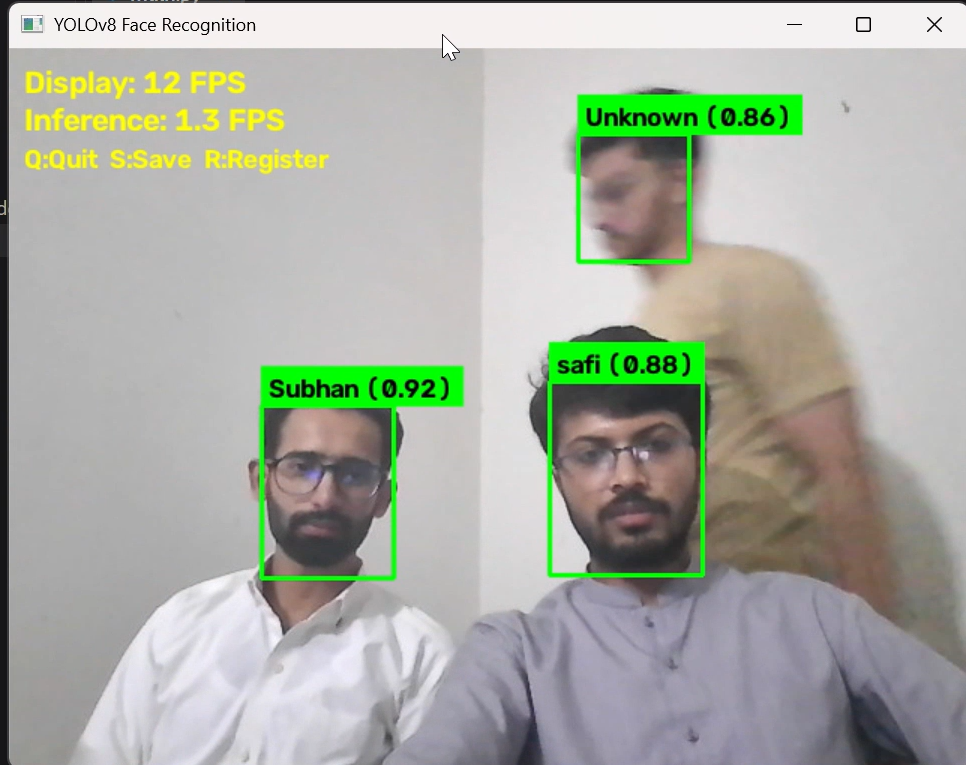
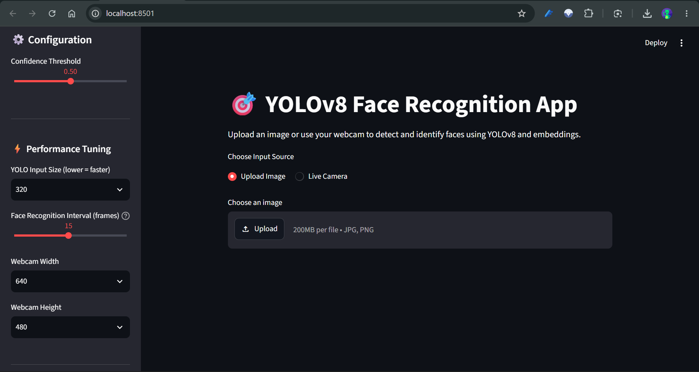
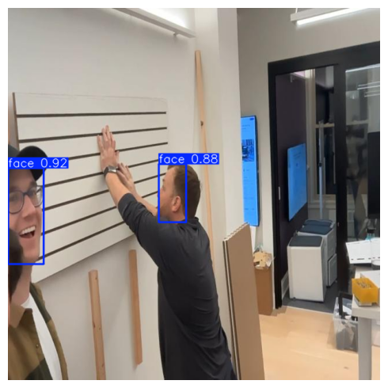

# 👤 Real-Time Face Detection and Recognition using YOLOv8


A real-time face detection and recognition system built using **YOLOv8**, **OpenCV**, and **Streamlit**. The project combines a custom-trained YOLOv8 face detector with real-time face recognition using a local database of known individuals. It provides both a lightweight desktop application for fast inference and a Streamlit web application for an interactive user experience.

---

# 📌 Project Highlights

- ✅ Custom-trained YOLOv8s face detection model
- ✅ Real-time face recognition using a local face database
- ✅ Fast OpenCV desktop application
- ✅ Interactive Streamlit web application
- ✅ Live webcam face detection and recognition
- ✅ Automatic recognition of registered individuals
- ✅ Unknown face detection
- ✅ High detection precision and recall
- ✅ Lightweight and optimized for real-time inference
- ✅ Trained on Kaggle using NVIDIA Tesla T4 GPU

---

# 📂 Dataset

**Dataset:** [Face Detection Dataset (Roboflow Universe)](https://universe.roboflow.com/mohamed-traore-2ekkp/face-detection-mik1i)

The YOLOv8s model was trained using a publicly available face detection dataset from **Roboflow Universe**, which contains annotated facial bounding boxes for object detection.

> **Note:** This dataset is used **only for face detection training**. Face recognition is performed separately by comparing detected faces against images stored in the `known_faces` directory.

### Image Size

```text
640 × 640
```

---

# 🧠 Face Recognition Pipeline

```text
Live Camera / Image

↓

YOLOv8 Face Detection

↓

Extract Face Region

↓

Compare Against Faces in "known_faces"

↓

Recognized Person
        or
Unknown Person

↓

Display Bounding Box + Name
```

---

# 🏗️ Model Information

| Component | Value |
|-----------|-------|
| Model | YOLOv8s |
| Framework | Ultralytics YOLO |
| Task | Face Detection |
| Input Size | 640 × 640 |
| Deployment | OpenCV + Streamlit |

---

# ⚙️ Training Configuration

| Parameter | Value |
|-----------|-------|
| Framework | Ultralytics YOLOv8 |
| Model | YOLOv8s |
| Image Size | 640 |
| Hardware | Kaggle NVIDIA Tesla T4 GPU |
| Epochs | *Update* |
| Batch Size | *Update* |

---

# 📊 Model Performance

| Metric | Score |
|---------|------:|
| Precision | **0.991** |
| Recall | **0.959** |
| mAP@50 | **0.985** |
| mAP@50-95 | **0.793** |

The custom-trained YOLOv8s model achieved excellent detection performance while maintaining fast inference suitable for real-time face detection applications.

---

# ⚡ Inference Performance

Example prediction:

```text
Image Size        : 640 × 640

Inference Time   : 16.1 ms

Detected Faces   : 2
```

The optimized model delivers smooth real-time performance, making it suitable for live webcam applications.

---

# 🖥️ Applications

This repository includes **two different applications** for real-time face detection and recognition.

## 1. OpenCV Desktop Application (Recommended)

The desktop application is optimized for speed and real-time performance.

### Features

- Live webcam detection
- Real-time face recognition
- Bounding boxes
- Person name display
- Unknown face detection
- Lightweight and responsive
- Recommended for everyday use

Run the desktop application:

```bash
python main.py
```

---

## 2. Streamlit Web Application

The Streamlit application provides a clean browser-based interface for demonstrations and interactive usage.

### Features

- Browser-based interface
- Real-time webcam support
- Face recognition
- Easy to use
- Interactive controls

Run the Streamlit application:

```bash
streamlit run app.py
```

---

# 📸 Application Screenshots

## OpenCV Desktop Application



---

## Streamlit Web Application



---

## YOLOv8 Detection Results



---

# 🛠️ Technologies Used

- Python
- Ultralytics YOLOv8
- OpenCV
- Streamlit
- NumPy
- Pillow
- face_recognition

---

# 📁 Repository Structure

```text
YOLOv8-Face-Recognition/
│
├── app.py                     # Streamlit application
├── main.py                    # OpenCV desktop application
├── train_yolo.ipynb
├── README.md
├── requirements.txt
├── LICENSE
│
├── known_faces/
│
├── weights/
│   └── best.pt
│
├── images/
│   ├── opencv_app.png
│   ├── streamlit_app.png
│   └── predictions.png

```

---

# ▶️ Installation

Clone the repository:

```bash
git clone https://github.com/SafiUrRehmanAi/YOLOv8-Face-Recognition.git
```

Navigate to the project directory:

```bash
cd YOLOv8-Face-Recognition
```

Install the required packages:

```bash
pip install -r requirements.txt
```

---

# ▶️ Usage

### Run the OpenCV Desktop Application

```bash
python main.py
```

### Run the Streamlit Web Application

```bash
streamlit run app.py
```

To recognize known individuals, simply place their images inside the **known_faces** folder before launching the application.

---

# 🚀 Future Improvements

- Add support for video file inference
- Face registration directly from the application
- Face tracking for smoother real-time recognition
- Cloud deployment for remote access
- Optimize inference for edge devices
- Support multiple YOLO model variants (YOLOv8n, YOLOv8m, YOLO11)

---

# 📜 License

This project is licensed under the **MIT License**.
